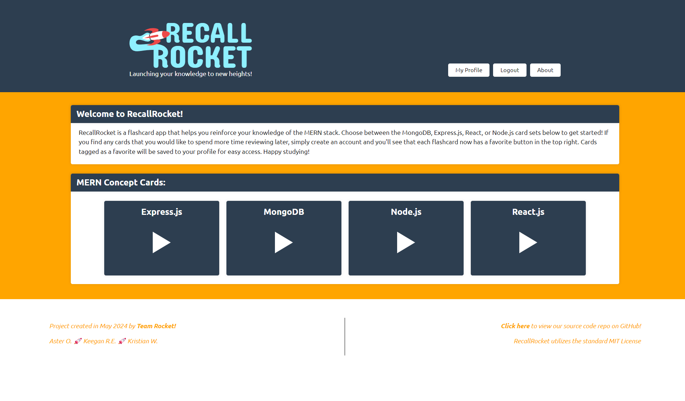

# RecallRocket

## Description

This was a collaborative project to create a flash-card study app, helping users reinforce their code knowledge and review core concepts of the MERN stack. Built with React, Apollo/GraphQL & MongoDB.

## Table of Contents

- [Introduction](#introduction)
- [Problem](#problem)
- [Solution](#solution)
- [Deployment](#deployment)
- [Contributors](#contributors)
- [Credits](#credits)
- [Contact](#contact)
- [License](#license)

## Introduction

The concept for RecallRocket was inspired by our shared experience learning MERN stack concepts in the EdX full-stack bootcamp we were participating in. RecallRocket took shape as a flashcard study tool to help new developers and seasoned devs alike review their MongoDB, Express, React and Node skills!

## Problem

As a team, we were tasked with creating an application that utilized React.js for the frontend UI, MongoDB for the database, and GraphQL/Apollo server to handle the backend interactions, as well as handling user logins with JSON web tokens.

## Solution

We created an application that allows for self-study of the core concepts of the MERN stack and allows users to create their own cards, once logged in. Future functionality should include the ability to rate the difficulty of cards, view other user's profiles, multiple choice timed quizzes, a leaderboard for the timed quizzes, and a dark/light mode.

See below for some screenshots of our application:

## Deployment

The project is deployed at the following URL: [RecallRocket](https://recall-rocket.onrender.com)

## Contributors

Aster Oliva, Kristian Wareing, and Keegan Royal-Eisenberg worked together to create this project.

## Credits

We referenced the following open source code in building this application:

[Scrollbar styling](https://codepen.io/patrikx3/pen/ZEBQQyV)

[Animated menu icon](https://www.w3schools.com/howto/howto_css_menu_icon.asp)

[React-card-flip npm package](https://www.npmjs.com/package/react-card-flip)

We also utilized ChatGPT & GitHub Copilot for debugging and illustrating code concepts.

## Contact

Please reach out to one of us at the following contact methods if you have any questions about this project:

Aster Oliva:

[GitHub Profile](https://github,com/joshjac16) | [Email](mailto:asterthealabaster@gmail.com)

Kristian Wareing:

[GitHub Profile](https://github.com/AaronH-o) | [Email](mailto:l1gw@outlook.com)

Keegan Royal-Eisenberg:

[GitHub Profile](https://github.com/ktetsuyama) | [Email](mailto:kroyal.eisenberg@gmail.com)

## License

This project is covered under the standard MIT license for open-source projects.

Learn more about this license [here](https://opensource.org/licenses/MIT).
